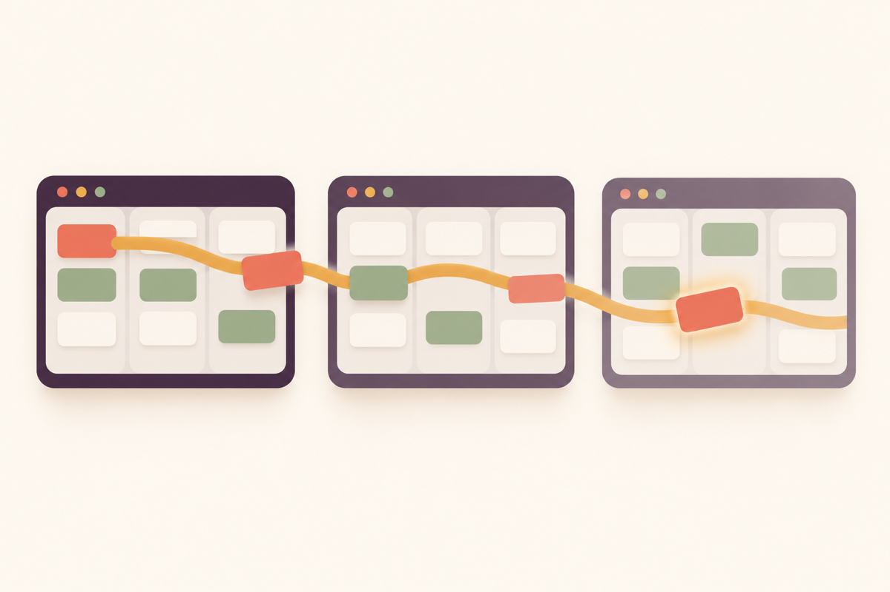

# Cyberine TaskBoard



A backlog that outlives every Claude Code session. Claude Code's own todo list dies with the session; Cyberine TaskBoard keeps the backlog in a file inside your repository, and every new session opens with a one-line banner saying what is in progress, what is next and what is blocked.

- **The board is a file in your repository.** Plain Markdown, readable in any editor and diffable in any pull request. Personal by default (`.local/`, gitignored), or shared with the team as a tracked `.claude/TASKS.md`.
- **Claude cannot hand-edit it.** A guard hook refuses direct edits of the board files, so every change goes through one CLI that takes a lock, validates every field and checks the task count before and after each write.
- **Work carries its context.** Tasks saved from a conversation keep a brief (intent, decisions, rejected approaches, gotchas) so the next session does not re-argue a settled call, and a task is closed with the evidence that was actually observed.
- **Local only.** No network, no account, no API key, no cost, no dependencies.

## Install

In Claude Code:

```
/plugin marketplace add cyberinecore/cc-task-board
/plugin install cyberine-taskboard@cyberine-taskboard
```

From a shell:

```bash
claude plugin marketplace add cyberinecore/cc-task-board
claude plugin install cyberine-taskboard@cyberine-taskboard
```

Cyberine TaskBoard needs Claude Code 2.1.139 or later (exec-form hooks) and Node.js 20 or later on the `PATH` that Claude Code runs hooks with. It installs nothing else.

## Start a board

A repository has no board until you create one, and the banner stays silent until then. Run `/cyberine-taskboard:init` and pick one:

| Board | File | Shared? |
|---|---|---|
| Personal (default) | `.local/tasks/ACTIVE.md` (`.local/` is added to `.gitignore`) | no |
| Shared with the team | `.claude/TASKS.md`, tracked in git | yes |

## Use it

Four commands, and everything else is said in plain words:

| Command | Started by | For |
|---|---|---|
| `/cyberine-taskboard:tasks` | you, or Claude when you talk about the board | with nothing after it: what to pick up next, and why |
| `/cyberine-taskboard:init` | you | start a board |
| `/cyberine-taskboard:end` | you, or Claude when you say "taskboard end" or "wrap up the taskboard" | wrap up: archive finished tasks, report what is left |
| `/cyberine-taskboard:help` | you | what the plugin does |

Things to say, with or without `/cyberine-taskboard:tasks` in front:

- "save these as tasks": Claude checks the board for duplicates, splits the work one concern per task, orders it by dependency and writes a brief for each, then applies the batch all-or-nothing.
- "what's next", "start on the rate limiter", "that's done": Claude answers with the task's title and the board's reason, and closes a task with evidence it observed (an exit code, a response, a line of output), or asks whether to check first or close it as unverified.
- Vietnamese works too, with or without diacritics: "task nao tiep", "xong roi", "de sau", "ket vi chua co key".
- "block k7m2q on the API key", "unblock k7m2q": a blocker is an outside condition; waiting on another task is a dependency and is tracked separately.
- "every Monday, update dependencies": recurring chores with their own cadence.
- "show me the board": a read-only, self-contained HTML page with a Kanban, a sortable table, recurring, archive and journal tabs.

The CLI can also be run directly: `node <plugin dir>/cli/tasks.mjs <subcommand>` (`--help` lists them, `--version` names the build).

## What runs, and when

| Piece | When | What it does |
|---|---|---|
| Banner (`SessionStart`) | startup, resume, `/clear`, compaction | shows the board's counts on screen and gives Claude the counts plus the task to resume; silent without a board or while the board has no tasks |
| Guard (`PreToolUse`) | every Write, Edit, MultiEdit, NotebookEdit, Bash, PowerShell and Monitor call | refuses a direct edit of a board file or a shell or PowerShell command that writes one (reading is fine), including a path that differs only in letter case; silent for everything else |

Both run `node` on the bundled `hooks/board-hooks.mjs`, which calls the bundled CLI only when it matters (the guard skips any call that names no board file), and neither touches the network.

Besides the board, the plugin runs `git` (repository root, ignore checks, and at wrap-up the recent commit messages and uncommitted paths) and `open` or `xdg-open` only when you ask for the board page with `--open`. It sends nothing anywhere. Every file and environment variable it reads or writes is listed in [PRIVACY.md](PRIVACY.md).

## Limits

- The guard sees Write, Edit, MultiEdit, NotebookEdit, Bash, PowerShell and Monitor. A PowerShell or Monitor command that writes somewhere the guard cannot work out before it runs, and that names a board path, is refused. A board write through an MCP tool, a `!` command, code run by another interpreter (`node -e`, `python -c`), a path built by string formatting, or a Bash command that writes through a variable is not caught; the skill forbids those routes.
- Without `node` on the hook `PATH`, or when a hook times out, the banner is silent and the guard does not run.
- `TASKBOARD_ROOT=<dir>` pins the board to that directory instead of the repository root.
- Journal entries record who made a change as `<user>@<pid>`.
- A board records its format version. When a newer plugin version has changed a shared board's format, an older copy refuses to write it (reading still works) and asks to be updated, so two teammates on different versions can never corrupt one board.
- When another board plugin that already shows this banner and guards these files is installed and active, TaskBoard's banner and guard stay silent so you see each only once. The guard still checks PowerShell and Monitor calls, which that plugin does not guard.

## Uninstall

`claude plugin uninstall cyberine-taskboard@cyberine-taskboard`, then `claude plugin marketplace remove cyberine-taskboard`. Your boards stay in their repositories; delete `.local/tasks/` or `.claude/TASKS.md` to remove one.

## Privacy and security

See [PRIVACY.md](PRIVACY.md) and [SECURITY.md](SECURITY.md). License: MIT.
